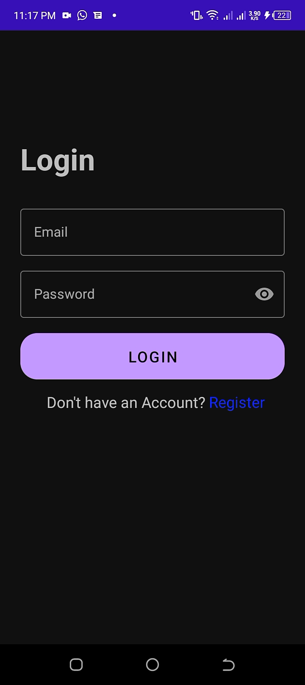
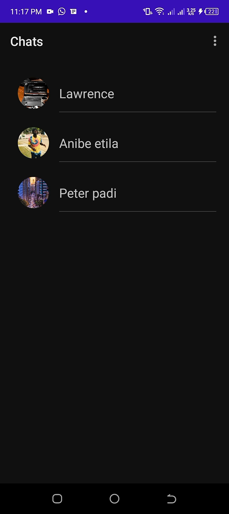
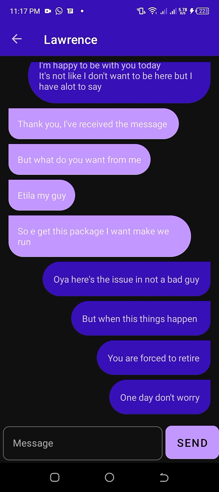
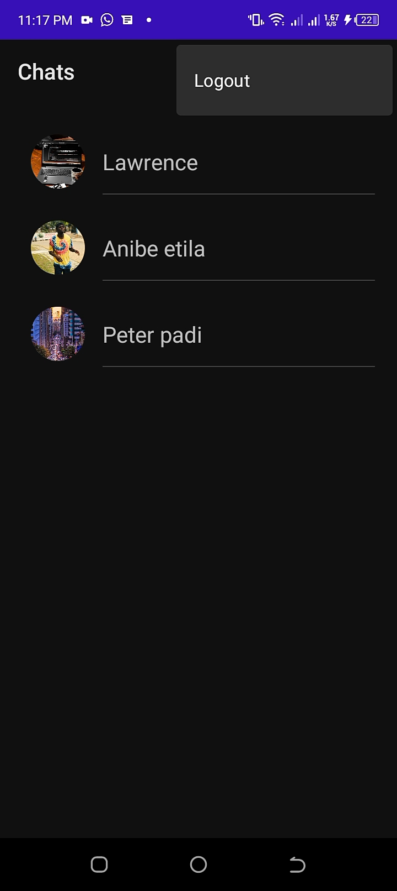

# Realtime-Chat-App

## Overview
As we all know every chat system ever created like the Facebook, WhatsApp etc, where created to aid communication,
so this like every other Chat app, uses firebase database for storage of both the messages and pictures and personal info,
it fully uses kotlin, not jetpack compose, some external libraries were added, like picasso to load images.

## Usage and Manual
Run on Android studio, delete the previous firebase path and add yours

## Acknowledgments
I'm am grateful to God for the grace to be consistent in this work and also to my parents and friends, that's 
support me in this journey
